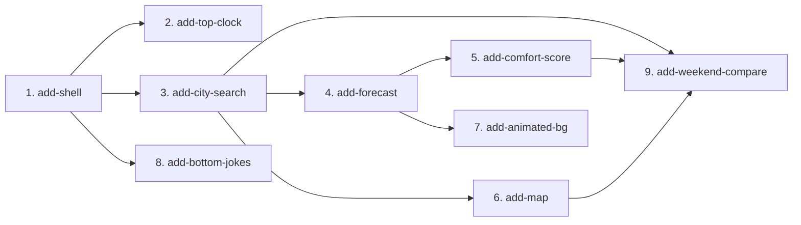

# MVP Capability Change Plan

**Step 4 of the SDD process** — split the MVP into capability changes that the
delivery loop executes one-by-one (proposal → spec deltas → design → tasks →
implementation → tests → review gate → archive).

> Inputs: [docs/product-brief.md](product-brief.md), [docs/requirements.md](requirements.md),
> baseline specs under `openspec/specs/`.
>
> **Checkpoint 2:** plan approved by product owner before starting G4 slices.

## 1. Slicing principles

1. One slice ≈ one cohesive capability, sized to design/build/test/archive as a unit.
2. Dependency-respecting order — foundations first; no slice depends on a sibling
   shipping after it.
3. One owner per requirement — every MVP FR assigned to exactly one slice (no gaps,
   no duplicates). Domain-bound NFRs travel with their domain; cross-cutting NFRs
   are honored by every slice.
4. Baseline-spec aligned; bundle multiple specs only when tightly coupled.
5. Naming: kebab-case `add-<capability>` under `openspec/changes/`.

## 2. The capability changes

| # | Change name | Baseline specs touched | MVP FRs | NFRs travelled | Depends on | Parallel |
|---|-------------|------------------------|---------|----------------|------------|----------|
| 1 | `add-shell` | `shell` (pending) | FR-SHELL-01, FR-SHELL-02, FR-SHELL-03 | NFR-A11Y-01, NFR-A11Y-02, NFR-I18N-01, BC-BRAND-01 | — | serialize |
| 2 | `add-top-clock` | `top-clock` (pending) | FR-CLOCK-01 | NFR-A11Y-01, NFR-OBS-01 | 1 | parallel-safe |
| 3 | `add-city-search` | `city-search` (pending) | FR-SEARCH-01 … FR-SEARCH-05 | NFR-PERF-03, NFR-OBS-01, BC-PRIVACY-02, TC-DATA-01 | 1 | parallel-safe |
| 4 | `add-forecast` | `forecast` (pending) | FR-FORECAST-01 … FR-FORECAST-05 | NFR-PERF-01, NFR-OBS-01, TC-DATA-01, TC-STACK-03 | 3 | serialize |
| 5 | `add-comfort-score` | `comfort-score` ✅ | FR-COMFORT-01 … FR-COMFORT-05 | NFR-I18N-01, BC-BRAND-01, TC-PURE-01 | 4 | parallel-safe |
| 6 | `add-map` | `map` (pending) | FR-MAP-01 … FR-MAP-05 | NFR-PERF-03, NFR-A11Y-01, TC-MAP-01, TC-STACK-04 | 3 | parallel-safe |
| 7 | `add-animated-bg` | `animated-bg` (pending) | FR-ANIM-01 … FR-ANIM-04 | NFR-PERF-03, NFR-A11Y-01 | 4 | parallel-safe |
| 8 | `add-bottom-jokes` | `bottom-jokes` (pending) | FR-JOKES-01 | BC-BRAND-01, BC-BRAND-02, BC-PRIVACY-01 | 1 | parallel-safe |
| 9 | `add-weekend-compare` | `weekend-compare` (pending) | FR-COMPARE-01 … FR-COMPARE-03 | NFR-A11Y-01, NFR-I18N-01 | 3, 5, 6 | serialize |

**Cross-cutting NFRs every change MUST honor:**

| ID | Summary |
|----|---------|
| NFR-PERF-01 | Preview TTFB ≤ 300 ms p95 |
| NFR-PERF-02 | Lighthouse Performance ≥ 90 |
| NFR-PERF-03 | Initial client JS ≤ 200 KB gzipped |
| NFR-A11Y-01 | Lighthouse Accessibility ≥ 95; focus + names |
| NFR-A11Y-02 | WCAG AA contrast (light + dark) |
| NFR-COST-01 | Zero paid API keys |
| NFR-OBS-01 | Silent console on healthy session |
| NFR-DX-01 | lint + tsc + test + build < 60 s |
| NFR-I18N-01 | Strings in `lib/i18n/uk.ts` / `en.ts` |

**Cross-cutting BC/TC:** BC-PRIVACY-01/02/03, BC-BRAND-01/02, BC-DEMO-01, TC-STACK-01/02,
TC-DEPLOY-01.

## 3. Dependency graph

**Critical path:** `add-shell` → `add-city-search` → `add-forecast` →
`add-comfort-score` → `add-weekend-compare` (5 sequential gates on the main
decision flow).

**Parallelizable after forecast (slice 4):** slices **5**, **6**, and **7** touch
disjoint modules (`lib/scoring/`, map client bundle, background canvas) and may
run in isolated git worktrees once slice 4 is archived. Slices **2** and **8** may
run in parallel after slice **1**. Slice **9** must wait for **3**, **5**, and **6**.

## 4. Per-change scope and exit criteria

### 4.1 `add-shell`

- **Scope in:** App layout, responsive grid (`FR-SHELL-02`), top bar + main area
  (`FR-SHELL-01`), empty-state hero (`FR-SHELL-03`), Sky Calm tokens from
  `DESIGN.md`, i18n scaffold.
- **Scope out:** Search, forecast, map, comfort logic.
- **Baseline spec impact:** Author `openspec/specs/shell/spec.md`.
- **Definition of done:**
  - Layout breakpoints match DESIGN.md at 768 px and 1280 px.
  - Empty state renders without a default city.
  - `npm run lint && npm run build` green; slice archived with review evidence.
- **Risks:** shadcn/ui base-nova setup — capture in ADR if non-default.

### 4.2 `add-top-clock`

- **Scope in:** Live local-time clock in header (`FR-CLOCK-01`).
- **Scope out:** Location timezone sync (uses visitor clock until forecast slice).
- **Baseline spec impact:** `openspec/specs/top-clock/spec.md`.
- **Definition of done:** Clock updates every minute; accessible name present.
- **Risks:** SSR/hydration mismatch — client-only tick or suppressHydrationWarning.

### 4.3 `add-city-search`

- **Scope in:** Debounced geocoding combobox, URL sync (`?lat=&lon=&name=`),
  zero-results inline message, Enter auto-select (`FR-SEARCH-01` … `FR-SEARCH-05`).
- **Scope out:** Forecast fetch, map click-to-set (map slice).
- **Baseline spec impact:** `openspec/specs/city-search/spec.md`.
- **Definition of done:** Selecting a city updates URL and active-location state;
  geolocation only on explicit button (`BC-PRIVACY-02`).
- **Risks:** Open-Meteo geocoding rate limits — debounce + cache in `lib/`.

### 4.4 `add-forecast`

- **Scope in:** 7-day Open-Meteo fetch, day cards, 48 h Recharts line, sunrise/sunset,
  in-memory cache per location (`FR-FORECAST-01` … `FR-FORECAST-05`).
- **Scope out:** Comfort badge wiring (slice 5), compare table.
- **Baseline spec impact:** `openspec/specs/forecast/spec.md`.
- **Definition of done:** Cards render for active location; refetch on location change;
  API errors degrade inline without blank screen.
- **Risks:** Recharts bundle size vs `NFR-PERF-03` — dynamic import.

### 4.5 `add-comfort-score`

- **Scope in:** Pure `comfortScore()` in `lib/scoring/comfort.ts`, badge tiers,
  weekend highlight strip (`FR-COMFORT-01` … `FR-COMFORT-05`); baseline spec ✅.
- **Scope out:** Multi-city compare (`FR-COMPARE-02`); scoring weight tuning ADR.
- **Baseline spec impact:** `openspec/specs/comfort-score/spec.md` (exists).
- **Definition of done:**
  - Unit tests with `@trace FR-COMFORT-*` green; rain rationale eval passes.
  - Day cards show badge + rationale; weekend strip above grid.
  - `TC-PURE-01` — no Next/React in `lib/scoring/`.
- **Risks:** Qualitative rationale — output eval for «приємно» in rain (`evals/cases/`).

### 4.6 `add-map`

- **Scope in:** Leaflet OSM map, marker + popup, click-to-set location with reverse
  geocode, attribution, client-only SSR skeleton (`FR-MAP-01` … `FR-MAP-05`).
- **Scope out:** Compare columns (slice 9).
- **Baseline spec impact:** `openspec/specs/map/spec.md`.
- **Definition of done:** Map loads client-side only; OSM attribution visible;
  click updates active location and triggers forecast refetch.
- **Risks:** Tile usage policy — HTTPS + Referer (`TC-MAP-01`).

### 4.7 `add-animated-bg`

- **Scope in:** Condition-driven gradient + particles, sunrise/sunset day/night,
  `prefers-reduced-motion` static fallback, pointer-events none (`FR-ANIM-01` … `FR-ANIM-04`).
- **Scope out:** Map layers; comfort scoring.
- **Baseline spec impact:** `openspec/specs/animated-bg/spec.md`.
- **Definition of done:** Background reflects today's condition; reduced-motion respected.
- **Risks:** Canvas performance on low-end mobile — cap particle count.

### 4.8 `add-bottom-jokes`

- **Scope in:** Deterministic Ukrainian footer jokes, Open-Meteo/OSM credits
  (`FR-JOKES-01`, `BC-BRAND-02`).
- **Scope out:** External joke APIs, tracking.
- **Baseline spec impact:** `openspec/specs/bottom-jokes/spec.md`.
- **Definition of done:** Jokes rotate deterministically from location/date seed; no network.
- **Risks:** None significant.

### 4.9 `add-weekend-compare`

- **Scope in:** Pin up to 3 cities, weekend compare toggle, Sat/Sun table with comfort
  (`FR-COMPARE-01` … `FR-COMPARE-03`).
- **Scope out:** Server-persisted pins; more than 3 cities.
- **Baseline spec impact:** `openspec/specs/weekend-compare/spec.md`.
- **Definition of done:** Compare view shows hi/lo, precip %, comfort per city;
  sticky headers with "make active".
- **Risks:** Parallel forecast fetches for 3 cities — loading/error UX.

## 5. FR coverage check

| FR | Slice | FR | Slice | FR | Slice |
|----|-------|----|-------|----|-------|
| FR-SHELL-01 | 1 | FR-FORECAST-03 | 4 | FR-ANIM-02 | 7 |
| FR-SHELL-02 | 1 | FR-FORECAST-04 | 4 | FR-ANIM-03 | 7 |
| FR-SHELL-03 | 1 | FR-FORECAST-05 | 4 | FR-ANIM-04 | 7 |
| FR-CLOCK-01 | 2 | FR-MAP-01 | 6 | FR-COMPARE-01 | 9 |
| FR-SEARCH-01 | 3 | FR-MAP-02 | 6 | FR-COMPARE-02 | 9 |
| FR-SEARCH-02 | 3 | FR-MAP-03 | 6 | FR-COMPARE-03 | 9 |
| FR-SEARCH-03 | 3 | FR-MAP-04 | 6 | | |
| FR-SEARCH-04 | 3 | FR-MAP-05 | 6 | | |
| FR-SEARCH-05 | 3 | FR-COMFORT-01 | 5 | | |
| FR-JOKES-01 | 8 | FR-COMFORT-02 | 5 | | |
| FR-FORECAST-01 | 4 | FR-COMFORT-03 | 5 | | |
| FR-FORECAST-02 | 4 | FR-COMFORT-04 | 5 | | |
| | | FR-COMFORT-05 | 5 | | |
| FR-ANIM-01 | 7 | | | | |

Total: **32 MVP FRs across 9 slices** (no gaps, no duplicates).

## 6. Sequencing

**Recommended delivery order for the workshop critical path:**

1. `add-shell`
2. `add-city-search`
3. `add-forecast`
4. **`add-comfort-score`** ← first domain slice with full spec (G2 done)
5. `add-map` (may parallel with 4 after forecast ships)
6. `add-weekend-compare`
7. Remaining polish: `add-top-clock`, `add-animated-bg`, `add-bottom-jokes`

After each archive run `npx @fission-ai/openspec@latest validate --all --strict`
and `npm run check:trace` before starting the next slice.

Future-phase work (accounts, push, native app) is NOT in this plan — see
`docs/requirements.md` § Out of scope.
